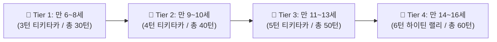
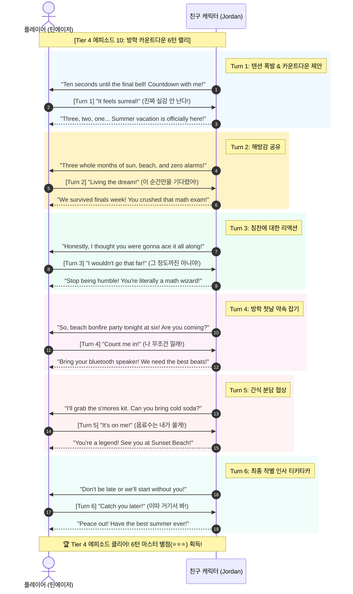

# [설계서 초안] TalkieTown US - 미국 실생활 구어체 회화 웹 게임

> **문서 버전**: v0.4 (1.5배 차등 턴 수 확장: Tier 1: 3턴, Tier 2: 4턴, Tier 3: 5턴, Tier 4: 6턴 / 총 40개 에피소드 180턴)  
> **최종 수정일**: 2026-09-19  
> **상태**: 4대 연령 티어별 1.5배 차등 멀티턴(3~6턴) 구조 확정 및 반영 완료

---

## 1. 프로젝트 개요 (Overview)

| 항목 | 내용 |
| :--- | :--- |
| **프로젝트 명칭** | **TalkieTown US** *(토키타운 US)* |
| **목적** | 미국 현지 또래 아이들과 청소년들이 일상에서 실제로 쓰는 **100% 실생활 구어체(Spoken English & Slang)**를 롤플레잉 게임으로 체득 |
| **연령 체계** | **4단계 확장 티어 (만 6세 ~ 16세, 유초등부터 틴에이저까지)** |
| **에피소드 구조** | **티어별 1.5배 차등 멀티턴 스토리라인 (Tier 1: 3턴, Tier 2: 4턴, Tier 3: 5턴, Tier 4: 6턴 / 총 180턴)** |
| **타깃 플랫폼** | 반응형 웹 (스마트폰, 태블릿, PC 전 기기 완벽 지원) |
| **배포 환경** | **Vercel** (무료 자동 HTTPS 지원으로 마이크 음성인식 최적화, 0원 무중단 호스팅) |
| **조작 모드** | **듀얼 입력 지원** (🎙️ 마이크 음성 발음 모드 ↔️ 👆 터치/카드 선택 모드 실시간 토글) |
| **비주얼 스타일** | **2가지 선택형 테마** (1: 키즈 캐주얼 카툰 / 2: 아메리칸 코믹스 웹툰) |

---

## 2. 4단계 확장 연령 체계 (4-Tier Age Curriculum)

연령 티어를 1단계 상향 확장하여 초등 고학년을 넘어 미국 중학교(Middle School) 및 틴에이저들이 실제로 쓰는 하이틴 슬랭까지 포괄하도록 구성했습니다.



| 티어 | 대상 연령 | 에피소드 / 턴 수 | 대표 환경 | 핵심 목표 구어체 & 슬랭 예시 |
| :--- | :--- | :---: | :--- | :--- |
| **Tier 1** | **만 6~8세**<br>(초등 저학년) | **10개 / 3턴씩**<br>(총 30턴) | 놀이터, 장난감방, 간식 시간 | - *"Look at that!"* (저것 좀 봐!)<br>- *"Can I play?"* (나도 같이 놀아도 돼?)<br>- *"My turn!"* (내 차례야!)<br>- *"No biggie!"* (별거 아니야!) |
| **Tier 2** | **만 9~10세**<br>(초등 중학년) | **10개 / 4턴씩**<br>(총 40턴) | 학교 운동장, 급식실, 생일 파티 | - *"I call dibs!"* (내가 찜했어!)<br>- *"Count me in!"* (나도 낄래!)<br>- *"Hold your horses!"* (진정해!)<br>- *"Save me a seat!"* (자리 맡아줘!) |
| **Tier 3** | **만 11~13세**<br>(초등 고학년) | **10개 / 5턴씩**<br>(총 50턴) | 쇼핑몰, 과학실, 방과 후 활동 | - *"I'm totally down."* (완전 콜이지!)<br>- *"Don't sweat it."* (신경 쓰지 마!)<br>- *"That's so sick!"* (대박 쩐다!)<br>- *"It's on me."* (내가 쏠게!) |
| **Tier 4** | **만 14~16세**<br>(중등/청소년) | **10개 / 6턴씩**<br>(총 60턴) | 락커룸, 패스트푸드점, SNS/채팅 | - *"No cap!"* (진짜 실화야!)<br>- *"Bet!"* (당연하지, 콜!)<br>- *"I'm lowkey nervous."* (은근 긴장돼)<br>- *"You ate that up!"* (완전 찢었다!) |

---

## 3. 에피소드 대화 구성 원리: 1.5배 차등 멀티턴 연속 스토리

> **핵심 설계 원칙: "에피소드는 단발 대화가 아니라, 연령대 발달 단계에 맞춰 1.5배씩 차등 확장된 3~6턴 연속 실전 티키타카 롤플레잉 구조입니다."**

### 3.1 에피소드와 스텝/턴의 관계
- **에피소드 (Episode)**: 하나의 완결된 상황 퀘스트 (4개 티어 × 10개 = **총 40개 에피소드**)
- **스텝/턴 (Step/Turn)**: 에피소드 안에서 연속 발화하는 티키타카 단계 (**총 180턴**)
  - **Tier 1 (저학년 만 6~8세)**: **3턴** (도입 ➜ 호응 ➜ 훈훈한 마무리)
  - **Tier 2 (중학년 만 9~10세)**: **4턴** (도입 ➜ 제안 ➜ 돌발 상황 ➜ 합의)
  - **Tier 3 (고학년 만 11~13세)**: **5턴** (발견 ➜ 의견 교환 ➜ 반박/공감 ➜ 대안 ➜ 성공 축하)
  - **Tier 4 (틴에이저 만 14~16세)**: **6턴** (현지 고교생 실전 6턴 랠리 티키타카)



### 3.2 왜 1.5배 차등 멀티턴(3~6턴) 구조인가?
1. **인지 발달 부합형 호흡 설계**:
   - 저학년(Tier 1)은 3턴으로 집중력을 잃지 않으면서도 온전한 기승전결(시작-전개-끝)을 체득.
   - 고학년 및 틴에이저(Tier 3~4)는 5~6턴의 숨 가쁜 랠리를 통해 끊김 없는 미국 원어민 티키타카 체득.
2. **실전 뉘앙스 밀도 극대화**:
   - 단순 묻고 답하기를 넘어, 맞받아치기(Comeback), 유머, 감탄, 제안, 약속까지 유기적으로 연결.
3. **총 180턴 볼륨 확보**:
   - Tier 1 (30턴) + Tier 2 (40턴) + Tier 3 (50턴) + Tier 4 (60턴) = 총 180턴의 방대한 구어체 데이터베이스 구축.

---

## 4. 데이터 모델 설계 (`episodes.schema.ts`)

```typescript
export interface DialogueTurn {
  turnIndex: number;         // 턴 순서 (1, 2, 3...)
  npcSpeaker: {
    name: string;
    avatar: string;          // 이모지 또는 캐릭터 키
    textEn: string;          // NPC 발화 영어
    textKr: string;          // 한국어 자막
  };
  missionEn: string;         // 플레이어 발화 미션 영어
  missionKr: string;         // 플레이어 발화 미션 한국어 설명
  targetExpression: string;  // 음성인식(STT) 목표 구어체 문장
  acceptableVariants: string[]; // 유사 허용 문장 목록
  koreanTip: string;         // 한국어 뉘앙스/문화 팁
  options: {
    id: string;
    text: string;
    isCorrect: boolean;
    feedback: string;
  }[];
}

export interface Episode {
  id: string;                // 에피소드 고유 ID
  tierId: 'tier1' | 'tier2' | 'tier3' | 'tier4'; // 대상 연령 티어
  title: string;             // 에피소드 제목
  location: string;          // 장소 (Playground, Cafeteria, Mall, Locker Room 등)
  artKey: string;            // 매핑될 SVG 일러스트 키값
  turns: DialogueTurn[];     // 3~5개의 연속 턴 배열
}
```

---

## 5. 프로토타입 구현 현황
- 현재 제공된 프로토타입(`index.html`)은 다양한 상황과 표현을 한눈에 둘러보실 수 있도록 **각 티어별 5개 대표 씬(총 20개 씬)**을 빠르게 넘겨보는 형태로 구성되어 있습니다.
- 정식 버전에서는 1개 에피소드를 선택하면 내부에서 3~4턴의 대화가 유기적으로 이어지는 **에피소드 모드**로 확장 구동됩니다.
