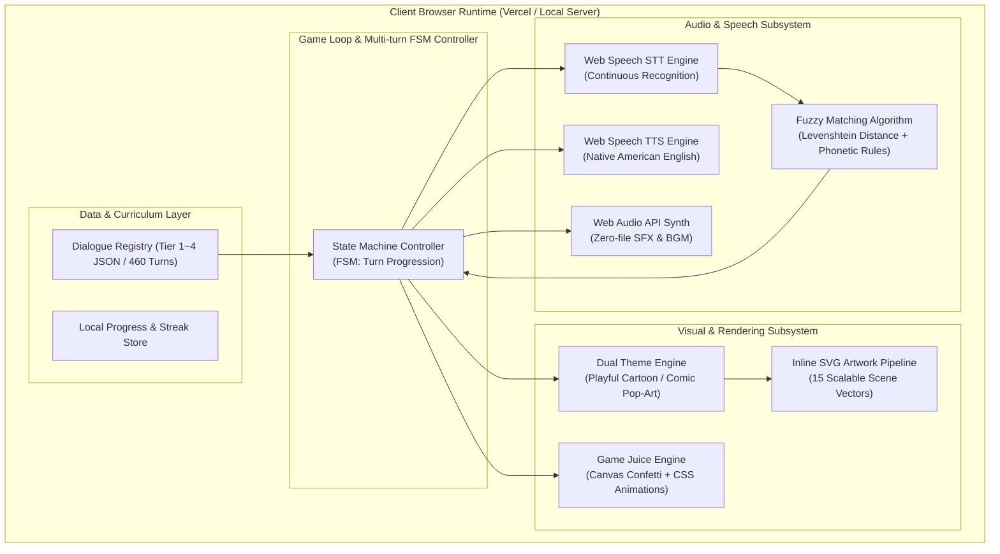

# 📐 TalkieTown US - 세부 기술 및 기능 설계서 (Detailed Technical Specification)

> **문서 버전**: v1.6 (기본동사 & 구동사 최고빈도 460턴 전면 확장: Tier 1: 10턴, Tier 2: 11턴, Tier 3: 12턴, Tier 4: 13턴 / 총 460턴)  
> **관련 문서**: [DESIGN_DRAFT.md](file:///C:/Users/tickl\PycharmProjects\english_game\DESIGN_DRAFT.md), [AGENTS.md](file:///C:/Users/tickl\PycharmProjects\english_game\AGENTS.md)  
> **상태**: 4개 티어 40개 에피소드 및 460턴 FSM 상태 머신 구현 확정

---

## 1. 시스템 아키텍처 개요 (System Architecture)

TalkieTown US는 **무의존성(Zero-External-Dependency)**, **초경량 고성능(Ultra-lightweight)**, **즉각적 반응성(Instant Interactivity)**을 원칙으로 설계된 웹 게임입니다.



---

## 2. 대화 커리큘럼 데이터 모델 및 JSON 스키마 (Data Model)

각 에피소드는 연령 티어에 따라 10~13턴의 `DialogueTurn` 배열을 포함하며, 턴마다 화자 정보, 플레이어 발화 미션, 선택지, 그리고 미국 문화 팁이 포함됩니다. 특히 **원어민 최고빈도 기본동사(get, take, make, have, put, keep, give, let, go, come, hold, turn, run, call...)** 및 **생활 구동사(put on, put back, put away, get off, get in, get going, get in line, pick up, pick out, clean up, watch out, hold on, hold up, come on, get on, hang on, hang out, eat up, give up, give back, throw away, make sure, make room, hurry up, count on, turn off, turn up, fill up, back up, keep it up, keep running, pull up, hit up, check out, chill out, wrap up, calm down, try on, point out, head out, hit the road, head home, pull over, live it up, kick off...)** 가 대화 전반에 체계적으로 녹아있습니다.

### 2.1 TypeScript 인터페이스 정의
```typescript
/** 4단계 연령 티어 구분 */
export type AgeTier = 1 | 2 | 3 | 4;

/** 터치 모드용 선택지 */
export interface ChoiceOption {
  text: string;
  isCorrect: boolean;
  tip: string;          // 정답 해설 또는 오답 피드백
}

/** 대화 단일 턴 스키마 */
export interface DialogueTurn {
  turnIndex: number;          // 턴 번호 (1 ~ 13)
  npcName: string;            // NPC 이름 (Penny, Leo, Sammy, Maya, Chloe, Jordan 등)
  npcAvatar: string;          // 이모지 (🦁, 🐧, 🦊, 🛹, 🎨, 🏀 등)
  npcEn: string;              // NPC 발화 영어
  npcKr: string;              // NPC 발화 한국어 번역
  mission: string;            // 플레이어 미션 안내 문구
  target: string;             // 발화/선택 목표 영어 구어체
  npcReactionEn: string;      // 플레이어 발화 후 NPC 즉시 리액션 (영어)
  npcReactionKr: string;      // NPC 즉시 리액션 (한국어)
  culturalTip: string;        // 미국 현지 문화/뉘앙스 꿀팁
  options: ChoiceOption[];    // 터치 모드용 3개 선택지 (정답 1 + 오답 2)
}

/** 에피소드 스키마 */
export interface DialogueEpisode {
  id: string;                 // 고유 ID (예: "t1_e1", "t4_e10")
  tierId: string;             // "tier1" | "tier2" | "tier3" | "tier4"
  title: string;              // 한국어 제목 (예: "모래성 감탄")
  episode: string;            // 에피소드 라벨 (예: "📍 Episode 1/10: Sandcastle Masterpiece")
  artKey: string;             // SVG 아트워크 키 (sandcastle, cafeteria, swing 등)
  turns: DialogueTurn[];      // Tier 1: 10턴, Tier 2: 11턴, Tier 3: 12턴, Tier 4: 13턴
}
```

---

## 3. 멀티턴 유한 상태 머신 (Multi-Turn Finite State Machine - FSM)

게임 루프는 에피소드 내에서 `turnIndex`를 전진시키며, 마지막 턴에 도달했을 때 에피소드 완료 및 티어 마스터로 전이합니다.

```mermaid
stateDiagram-v2
    [*] --> STATE_INIT : 페이지 로드 & 오디오 준비
    STATE_INIT --> STATE_TIER_SELECT : 티어 선택
    STATE_TIER_SELECT --> STATE_EPISODE_LOAD : 티어 선택 완료 (Tier 1~4)
    
    STATE_EPISODE_LOAD --> STATE_TURN_START : turnIndex = 0
    
    state TurnLoop {
        STATE_TURN_START --> STATE_NPC_TALK : NPC 대사 출력 & TTS 재생
        STATE_NPC_TALK --> STATE_INPUT_WAIT : 마이크/터치 활성화
        
        state STATE_INPUT_WAIT {
            [*] --> ModeRouter
            ModeRouter --> VoiceMode : 🎙️ Speech Recognition (STT)
            ModeRouter --> TouchMode : 👆 Choice Option Selection
        }
        
        STATE_INPUT_WAIT --> STATE_EVALUATE : 음성 수신 or 카드 선택
        STATE_EVALUATE --> STATE_RETRY : 유사도 < 70% or 오답 카드 (힌트 제공)
        STATE_RETRY --> STATE_INPUT_WAIT
        
        STATE_EVALUATE --> STATE_SUCCESS : 유사도 >= 70% or 정답 카드
        STATE_SUCCESS --> STATE_NPC_REACTION : NPC 리액션 말풍선 + TTS 자동 발화
        
        state NextCheck <<choice>>
        STATE_NPC_REACTION --> NextCheck : 2.8초 딜레이 or Next Turn 클릭
        NextCheck --> STATE_TURN_START : turnIndex < totalTurns - 1 (turnIndex++)
        NextCheck --> STATE_EPISODE_CLEAR : turnIndex == totalTurns - 1
    }
    
    state EpCheck <<choice>>
    STATE_EPISODE_CLEAR --> EpCheck : 에피소드 완료
    EpCheck --> STATE_EPISODE_LOAD : episodeIndex < 9 (다음 에피소드)
    EpCheck --> STATE_TIER_CLEAR_MODAL : episodeIndex == 9 (10개 에피소드 모두 정복)
    
    STATE_TIER_CLEAR_MODAL --> STATE_TIER_SELECT : 다음 티어 도전

---

## 4. 음성 인식(STT) 및 퍼지 매칭 알고리즘 (Speech & Fuzzy Match)

어린이의 불완전한 조음, 주변 소음, 브라우저 STT 변환 오차를 감안하여 **3단계 정규화 및 레벤슈타인 거리(Levenshtein Distance)** 기반의 유연한 채점 알고리즘을 적용합니다.

### 4.1 정규화 파이프라인 (Text Normalization)
1. **소문자화 및 구두점 제거**: 마침표(`.`), 느낌표(`!`), 쉼표(`,`), 물음표(`?`) 제거.
2. **단축형(Contractions) 확장 매핑**:
   - `"i'm"` ↔ `"i am"`
   - `"wanna"` ↔ `"want to"`
   - `"gonna"` ↔ `"going to"`
   - `"dibs"` ↔ `"i call dibs"`
3. **공백 정규화**: 연속 공백 및 앞뒤 공백 제거.

### 4.2 유사도 측정 및 점수 산출 로직
```javascript
/**
 * 레벤슈타인 거리를 이용한 두 문자열의 유사도 백분율(0 ~ 100) 계산
 */
function calculateSimilarity(recognizedText, targetText) {
  const normRec = normalizeSpeech(recognizedText);
  const normTarget = normalizeSpeech(targetText);

  // 1. 완전 일치 (100점)
  if (normRec === normTarget) return 100;

  // 2. 핵심 어구 포함 여부 검사 (포함 시 최소 80점 부여)
  if (normRec.includes(normTarget) || normTarget.includes(normRec)) {
    return Math.max(85, 100 - Math.abs(normRec.length - normTarget.length) * 3);
  }

  // 3. 레벤슈타인 편집 거리 계산
  const matrix = [];
  const len1 = normRec.length;
  const len2 = normTarget.length;

  for (let i = 0; i <= len1; i++) matrix[i] = [i];
  for (let j = 0; j <= len2; j++) matrix[0][j] = j;

  for (let i = 1; i <= len1; i++) {
    for (let j = 1; j <= len2; j++) {
      const cost = normRec[i - 1] === normTarget[j - 1] ? 0 : 1;
      matrix[i][j] = Math.min(
        matrix[i - 1][j] + 1,      // 삭제
        matrix[i][j - 1] + 1,      // 삽입
        matrix[i - 1][j - 1] + cost // 대체
      );
    }
  }

  const distance = matrix[len1][len2];
  const maxLen = Math.max(len1, len2);
  if (maxLen === 0) return 100;
  
  return Math.round((1 - distance / maxLen) * 100);
}
```

### 4.3 판정 임계값 (Thresholds)
- **90% ~ 100%**: 완벽한 발음 (별 3개 ⭐⭐⭐ + 퍼펙트 보너스 효과음)
- **70% ~ 89%**: 통과 가능한 발음 (별 2개 ⭐⭐ + 정답 통과)
- **70% 미만**: 재시도 유도 (부드러운 재안내 "한 번 더 말해볼까요? 🎙️" + TTS 모델 발음 다시 들려주기)

---

## 5. Web Audio API 신디사이저 사운드 아키텍처

외부 오디오 파일 로딩 지연과 CORS 오류를 100% 방지하기 위해 내장 오디오 신디사이저를 사용합니다.

| 사운드 이벤트 | 파형 (Oscillator Type) | 주파수 시퀀스 (Hz) | 엔벨로프 (ADSR) | 용도 |
| :--- | :--- | :--- | :--- | :--- |
| **`playSuccessChime()`** | Sine + Triangle | C5(523Hz) → E5(659Hz) → G5(784Hz) → C6(1047Hz) | Attack 0.02s, Decay 0.3s, Release 0.2s | 정답 맞힘 |
| **`playStreakBonus()`** | Triangle | G5(784Hz) → B5(988Hz) → D6(1175Hz) → G6(1568Hz) 고속 아르페지오 | Rapid 0.05s per note, Echo reverb | 연속 콤보 |
| **`playRetryBuzz()`** | Sawtooth | A3(220Hz) → F3(175Hz) 하강음 | Soft filter, low volume (아이 위축 방지) | 오답 재시도 |
| **`playPopBubble()`** | Sine | 400Hz → 800Hz 순간 상승 짹(Chirp) | 0.05s 초단기 릴리즈 | 버튼 터치 피드백 |

### 5.1 Web Speech API TTS 발화 음성 파이프라인
원어민 구어체의 생생한 뉘앙스를 왜곡 없이 전달하기 위한 5단계 음성 파이프라인이 구현되어 있습니다:
1. **원어민 보이스 자동 바인딩 (`getBestEnglishVoice`)**: OS가 한글 등 비영어 환경이더라도 브라우저 내장 프리미엄 미국 영어 음성(`Google US English`, `Microsoft Natural`, `Samantha`, `Jenny` 등)을 자동 감지하여 우선 바인딩.
2. **크로미움 GC 조기 수거 방지 (`window._activeUtterance`)**: 긴 문장 재생 도중 브라우저 V8 가비지 컬렉터가 인스턴스를 회수하여 음성이 끊기는 현상을 전역 참조 유지로 차단.
3. **순차 대화 발화 체이닝 (`onEnd` 콜백)**: 사용자가 고른 문장과 NPC의 리액션 문장이 겹치거나 잘리지 않고 `선택문 발화 ➔ 350ms 휴지기 ➔ NPC 리액션 발화` 순으로 자연스럽게 연결.
4. **턴/화면 전환 캔슬 및 인터럽트 안전 처리**: 사용자가 턴을 넘기거나 음소거(Sound OFF)할 때 잔여 음성을 즉각 취소(`speechSynthesis.cancel()`)하며, 취소된 음성의 콜백이 오작동하지 않도록 필터링.
5. **동적 발화 속도 제어**: 일반 모드(0.92x), 거북이 슬로우 모드(0.72x), 오답 모델링(0.65x) 지원.

---

## 6. 듀얼 비주얼 테마 시스템 (CSS & SVG Tokens)

| 디자인 토큰 | Theme 1: Playful Cartoon (동글동글 캐주얼) | Theme 2: Comic Pop-Art (아메리칸 코믹스) |
| :--- | :--- | :--- |
| **대표 분위기** | 따뜻한 파스텔, 부드러운 유아동 모험 | 역동적인 미국 그래픽노블, 볼드한 외곽선 |
| **Border** | `3px solid #E2E8F0` / 부드러운 그림자 | `3.5px solid #111827` (볼드 블랙) |
| **Border Radius** | `24px` ~ `32px` (매우 둥근 모서리) | `8px` ~ `12px` (각지고 단단한 형태) |
| **Box Shadow** | `0 10px 25px -5px rgba(0, 0, 0, 0.1)` | `5px 5px 0px #111827` (오프셋 코믹스 음영) |
| **폰트 스타일** | 둥근 고딕 (Pretendard / Nunito, rounded) | 볼드 임팩트 헤드라인 (Comic/Display) |
| **컬러 팔레트** | Sky Blue (#38BDF8), Coral Pink (#FB7185), Mint | Pop Yellow (#FACC15), Punch Red (#EF4444), Cyan |

---

## 7. 구현 마일스톤 및 에이전트 태스크 연계

- **Task 2.1**: 본 설계서에 기반하여 `index.html` 내 인라인 데이터 및 로직을 견고한 모듈러 코드로 최적화
- **Task 2.2**: 3단계 텍스트 정규화 및 레벤슈타인 퍼지 매칭 함수 통합
- **Task 2.3**: `qa_verifier`를 통한 브라우저 및 플랫폼 스모크 테스트 실행
